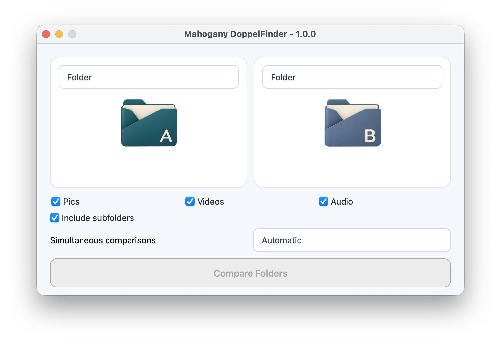

# Mahogany DoppelFinder

Find identical media content, even when filenames and locations differ.
Mahogany compares decoded images, animations, audio and video; it does not
search for visually or acoustically similar files.

## Choose a comparison

| A / B                  | What you get                                                                                                     |
| ---------------------- | ---------------------------------------------------------------------------------------------------------------- |
| File / File            | Compare two files, then open, move or send either file to the system Trash.                                      |
| File / Folder          | Find copies of a reference file inside a folder; review matching and different files. Works in either direction. |
| Folder / Folder        | Review shared content, files only in A/B, and files that could not be verified.                                  |
| Folder / No comparison | Find duplicates inside one folder and remove extra copies while keeping a checked copy.                          |

**Include subfolders** is enabled by default. Choose images, audio and/or video
before scanning. Automatic parallelism adapts to workload and available memory.

## Work with folders

- Select several file rows to copy, move or send them to Trash in one batch.
- **Folder A/B actions** act on the completed scan: remove matching files while
  keeping copies on the other side, or copy/move files found only on that side.
  Their media filter limits these whole-folder actions.
- Copying and moving preserve relative subfolders and filenames. Existing files
  are never overwritten: name conflicts can be renamed automatically or ignored.
- **Create folder C** makes a new combined folder outside A and B. It includes
  files exclusive to either side and shared content from your choice of A or B.
  Internal duplicates and subfolders are preserved; A and B stay unchanged.
  C uses all verified media in the scan, independently of the A/B action filter.

Actions require confirmation. Stopping a batch takes effect after the current
file; completed operations stay in place. Previews and their cache stay in RAM,
with no thumbnail files written by Mahogany. Native macOS Quick Look manages
its own system caches. Completed results update after actions without rescanning;
use **Scan again** for changes made outside the app.

See [the folder guide](docs/folder-guide.md) for examples and result labels,
or [the manual test cases](test/README.md) to try the features.

Licensed under [GNU GPL v3](LICENSE).
